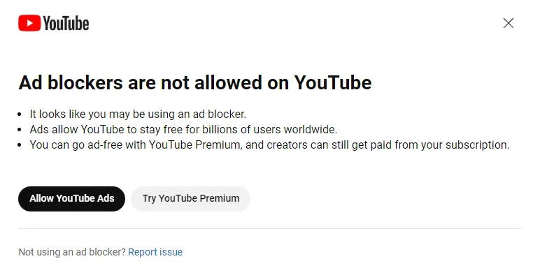
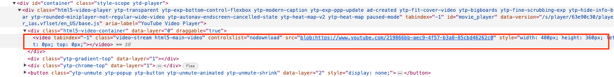
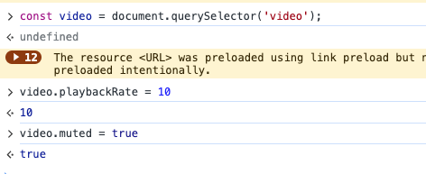
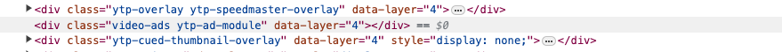
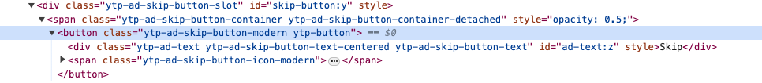
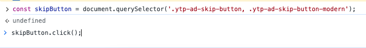
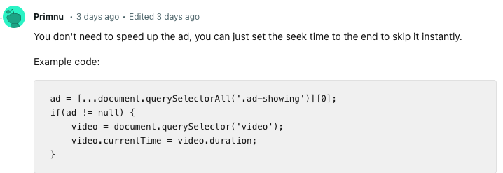
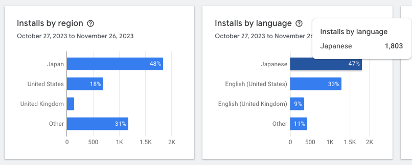
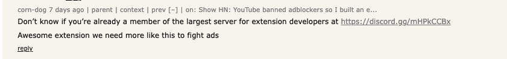
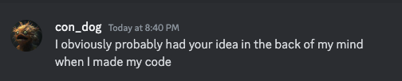

# Lessons from making a YouTube Ad Extension, going viral & getting copied


Recently I made a simple free [Chrome extension](https://chromewebstore.google.com/detail/ad-accelerator/gpboiedfklodfhngobidfjecdpmccehg?hl=en) to improve the YouTube experience without Adblockers & [open sourced the code (MIT License)](https://github.com/rkk3/ad-accelerator). [On Saturday Nov 18th I shared it on HackerNews (HN)](https://news.ycombinator.com/item?id=38327017) and it was well received, way beyond my expectations! Yay! 

Within days it was functionally copied and [uploaded to the chrome store](https://chromewebstore.google.com/detail/ad-speedup-skip-video-ads/pcjlckhhhmlefmobnnoolakplfppdchi) without the MIT License or any acknowledgement by another HN member and [owner of a Discord developer community (!) ](https://discord.gg/taqUQWNZDV) who had [seen and commented on my work](https://news.ycombinator.com/item?id=38327017&p=2#38328305). They presented it as their own and went viral on [Reddit](https://old.reddit.com/r/webdev/comments/181vbmk/youtube_is_now_blocking_ad_blockers_so_i_just/) then [HN](https://news.ycombinator.com/item?id=38397817#38398571) and [again on Reddit](https://old.reddit.com/r/webdev/comments/183ekw9/lets_beat_youtube_together_by_running_ads_16x/). [They even got some press](https://9to5google.com/2023/11/25/youtube-ads-speed-up-workaround/#:~:text=%E2%80%9CAd%20Speedup%E2%80%9D%20on%20the%20Chrome,their%20interruption%20of%20your%20content.) [^1] and [mentioned in a 400k+ view youtube video](https://www.youtube.com/watch?v=2yEE34BeBnA&t=295s)

This post is a reflection on building the extension, going viral, being copied, and  what I learned from the experience.


## Background

Starting in the summer of 2023 YouTube started gradually rolling out a prohibition on Adblockers, which ramped up in October 2023.

Currently there are still existing low hanging workarounds like:

* Ublock Origin on Firefox (as of November 2023)
   
* Not being logged into a Google Account (commonly  misattributed to private browsing)
   
* 14$/month for Premium (Ugh)

But when I got the below message last month, I thought it would be fun to explore hacky workarounds.




## My Machine My Rules
Since YouTube is ultimately run on our machines I knew there should be pretty wide latitude in what we could do to control the experience in the browser.

To start with I had two basic questions:

1. Can we manipulate the video?
2. Can we detect if there is an ad?

Turns out both are pretty easy.

----
### Can we manipulate the video?

Opening up inspector tools we can look at the html. 



There is an html5 video element we can grab.

In the console we can even test manipulating the video element's native properties



---
### Can we detect if it's an ad?

Again using inspector tools we can compare the HTML when there is an ad vs when there isn't. 

Ad

Not Ad


There is an element called .video-ads.ytp-ad-module and it's there all the time, but when there's non-ad it is empty.

So we can just select for it and check if its empty or not.

```
const adElement = document.querySelector('.video-ads.ytp-ad-module');
if (adElement && adElement.children.length > 0) {
...
}
```


---
### Turning it into an extension
At this point it was time to take this simple console hack and turn it into an extension. This was relatively straightforward and I needed ended up needing 3 files: manifest.json, content.js and background.js

the [manifest.json](https://github.com/rkk3/ad-accelerator/blob/main/manifest.json) file outlines basic properties such as the extension's name, version, description, permissions it requires, and which files to load. 

The [background.js](https://github.com/rkk3/ad-accelerator/blob/main/background.js) file contains code for a Chrome extension that listens for specific navigation events on the Chrome browser and executes a script in response. 

The [content.js](https://github.com/rkk3/ad-accelerator/blob/main/content.js) file contained very similar logic to what I shared above.
 
Since I wasn't familiar with extension development, the background.js file gave me the most trouble because it was getting triggered and silently erroring on sites other than youtube.com, which I didn't ask for permission to run on! Eventually I figured out how to catch that and I started testing my extension as I was watching a foreign tv series on YouTube.

---
### Adding support for the skip ad button

There seemed to be two kinds of video ads on YouTube. Short ads without a skip button and longer ads (several minutes+) that have a skip button.

Very quickly it seemed YouTube started serving multi minute long ads with a skip ad button. Presumably they detected I didn't click skip and thought it was better to feed those to me.

Once again looking at the HTML with inspector tools. 



Playing around in the console I found out that if the ad has a skip button, the button can be accessed programmatically even before you can click on it.



At this point the extension worked great for own personal use for several weeks.

However around when I submitted it to the Chrome webstore the second time YouTube changed the style for the skip button they were sending me. The video element was the same but the skip button changed to "ytp-ad-skip-button-modern" instead of "ytp-ad-skip-button".

I'm still not sure how many styles they use, but this is definitely the most fragile piece of the extension.

---
### Other learnings

10x speedup was an arbitrary choice, I thought it worked well enough especially with the skip button & didn't experiment going higher. It turns out from the multiple discussions and [a PR I received](https://github.com/rkk3/ad-accelerator/pull/2), that the maximum speed for manipulating video in Chrome is 16x. 

I haven't tested it yet but this person's suggestion on Reddit seems like an even better solution.


[link](https://old.reddit.com/r/webdev/comments/181vbmk/youtube_is_now_blocking_ad_blockers_so_i_just/kafxasq/)

It would even remove the need to support the skip ad button.


## Chrome Store
Honestly I wasn't sure if the Chrome webstore would even allow it, so I didn't spend a huge amount of time on the store posting and figured it was better just to ship. It took 3 days but it got approved!

Besides making Icons, the main thing I needed to do to submit was justify why the extension needed any permissions. I used chatgpt for this busy work with the permissions copy. It seemed poetic to use a machine to generate something that almost certainly will only ever be consumed by another machine.

Unfortunately after being approved I realized my first version had many public facing typos (adds vs ads etc.), and it took another 3 days for it to get re-approved for these non code changes.

In my most recent update, which was a small change to catch the modern style skip ad button, it only took a few hours to get approved. I assume because the number of users is now higher, it gets higher priority than the long tail of extensions without many users.

## Promotion
So after finishing the work, I decided to do a show HN post. I submitted the post and deliberately immediately left to take a walk & pick up take out. An hour later I checked and it was on the front page! Yay! Given the discussion, I think the hot topic of Youtube cracking down on adblockers was the cause more than the project itself, haha

## Google Analytics 
After hitting the frontpage of HN Saturday evening EST, I was curious to know how it affected the analytics. GitHub was instantaneous with updating counts of stars, forks etc. The Chrome webstore however... was not. For a while the webstore actually showed fewer users than the GitHub project had gotten stars

[Even a commenter on HN wanted to know how the extension was doing](https://news.ycombinator.com/item?id=38334625)!

So I waited... and waited... Finally Tuesday morning EST rolled around, it incremented up to 700 users. Later the same day it incremented up to 2K.

Over the past week the webstore stats seem to most often update in the early evening EST. I'm not sure if that is because of the traffic patterns of when people are installing it or the timing for the batch job.

## What is happening in Japan?

One of the first few reviews which I got an email for was in Japanese. Using google translate I understood that they said the auto skip ad button didn't work for them and gave me 3 stars. I assume it was the modern styling issue, which I had fixed but unfortunately hadn't uploaded to the store yet, as I didn't want to wait another 3 dyas for a Chrome Web Store review.

I waited but their review never appeared for me in the Webstore, so I couldn't respond. I'm still not sure how to access or view the Japanese reviews on the Chrome webstore. Since then I've received emails about several more reviews in Japanese.

Wednesday evening I checked and one of the analytics screens said 30% of users were from Japan. The same screen said there were only a few tens of users (elsewhere on the store it said around ~2k), so I assumed it was just even more behind. And it was! Turns out roughly half of the users were from Japan. This is what that screen looks like on 11/27




僕の作品をシェアしていただき本当に有難うございます。

I'm not sure how this happened, but a big thank you to everyone who shared it in Japan & everyone else who shared it around the world :)

## "What Is Property?" -Pierre-Joseph Proudhon
        
I assumed many people had or would come to similar ideas on their own when confronted with the obnoxiousness of YouTube ads (sans adblockers). [The top comment in my show HN thread even said they had made something similar themselves](https://news.ycombinator.com/item?id=38327017#38327385). I also wasn't expecting it to get the attention it did & I had zero intention to monetize which is why I chose open sourcing thinking maybe the community could support & expand it, if it was at all successful (more on this at the end).

So I wasn't too shocked when Thursday afternoon a [Reddit post](https://old.reddit.com/r/webdev/comments/181vbmk/youtube_is_now_blocking_ad_blockers_so_i_just/) about a *functionally identical* extension hit the top of [HN](https://news.ycombinator.com/item?id=38397817#38398571). I responded to a [commenter who mentioned the similarity to my post](https://news.ycombinator.com/item?id=38397817#38397999) but didn't look closely and walked away to go have Thanksgiving dinner with my family.

Yesterday I went back to look at it for this writeup when I realized they didn’t just come to it on their own. The same person had posted on HN complimenting my extension and *promoting their extension developer community* just days earlier.


[link](https://news.ycombinator.com/item?id=38327017&p=2#38328305)


Even though the response to my extension far exceeded my expectations, this really bummed me out. I was totally at peace with another successful extension in the wild doing the same or similar thing - but it felt different knowing that they saw my idea/code/extension, took it for themselves with *zero acknowledgement* and got more traction[^2]. Especially when Re-reading their "creator post". 


[link](https://news.ycombinator.com/item?id=38397817#38398571)


So yesterday I joined the Discord developer community they run, to let them know that it really hurt my feelings that they took my idea & project without any acknowledgement. I also wanted to let people who might be working on more serious projects that the owner of their developer community server might actively copy their projects - instead of supporting them.

Unsurprisingly after they saw my public Discord message, they kicked me from their server. They also kicked anyone else who had engaged in the conversation, and deleted all the public messages about it. 

However privately they reached out to "justify why they kicked me"[^3]. 
They did not offer any kind of apology or acknowledgement aside from this cheeky response:




Perhaps I'm wrong to feel they violated the spirit in which I shared the project. The irony of it being a hacky/piratey nature of the extension itself isn’t lost on me.

Mainly I think the negative feelings I now have are internally directed anger & disappointment. The frustration I feel with myself that I should have posted other places and not given them the opportunity. Next time I’ll be more aggressive with promotion.

To end on a more upbeat front, this morning I got a PR from [a member of the community](https://github.com/MadhuNimmo) expanding support of the extension to Hulu. Haven't tested it yet as of yet - I've  been busy writing this - but it makes me feel a little better about open sourcing and what the future may hold.


[^1]: I reached out to the author and on 11/27 they updated the article to include "Another extension that was posted to Hacker News a few days prior to 'Ad Speedup' already supports hitting the skip button, but only speeds ads up by 10x. 'Ad Accelerator' is also available on the Chrome Web Store." 

[^2]: As I mentioned Extension analytics are quite delayed so I'm not 100% sure but they got an order of magnitude more upvotes, got press and has significantly more reviews.

[^3]: They said "I accused them of stealing code", which I never did. I very permissibly open sourced the code... under the MIT license he could even sell it as long as he just included the license. Another person in the Discord chat did mistakenly say they had 1:1 copied my extension's source. However they had opened up my extension by mistake, and I corrected them when I looked at the source myself.
